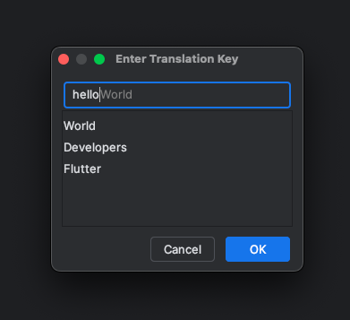

    

<h1 align="center">Flutter Arb Action</h1>

Plugin for IntelliJ-based IDEs (Android Studio).

# Table of contents

- [Core Features](#core-features)
- [Compatibility](#compatibility)
- [Install](#install)
- [Screenshots](#screenshots)

## Core features

<li>Detects arb file based on l10n.yaml file</li>
<li>Moves strings to arb file</li>
<li>Supports interpolated string</li>
<li>Simple completion system based on currently entered keys in arb file</li>
<li>Sorts arb file</li>

## Compatibility

IntelliJ IDEA, Android Studio

## Install

Or you could install it inside your IDE:

For Windows & Linux - <kbd>File</kbd> > <kbd>Settings</kbd> > <kbd>Plugins</kbd> > <kbd>Marketplace</kbd> > <kbd>Search for "Flutter_arb_action"</kbd> > <kbd>Install Plugin</kbd> > <kbd>Restart IntelliJ IDEA</kbd>

For Mac - <kbd>IntelliJ IDEA</kbd> > <kbd>Preferences</kbd> > <kbd>Plugins</kbd> > <kbd>Marketplace</kbd> > <kbd>Search for "Flutter_arb_action"</kbd> > <kbd>Install Plugin</kbd>  > <kbd>Restart IntelliJ IDEA</kbd>

## Screenshots

### Extension

### Configuration (l10n.yaml)

### Quick Fixes for String

### Move to arb dialog

### Results

